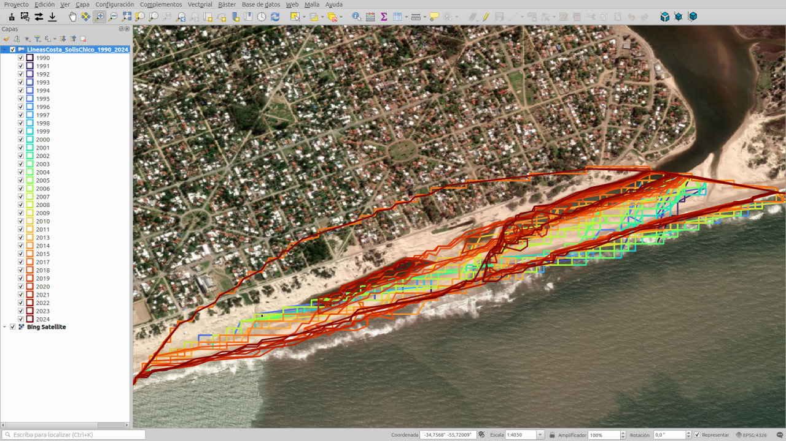

# Línea de costa - ejemplo del arroyo Solís Chico

Este repositorio contiene el código fuente para generar un script dinámico de Google Earth Engine (GEE) que permite extraer líneas de costa desde imágenes satelitales (Landsat y Sentinel-2) para el período 1990–2024.

---

## 🌐 Accede aquí a la miniweb

👉 [Ir al generador de script GEE](https://gaitapi.github.io/linea-costa-solis-chico)

Desde la miniweb podrás:

- Seleccionar un punto central sobre el mapa (con clic interactivo).
- Ajustar el radio de análisis (en metros).
- Generar el código completo listo para copiar y pegar en Google Earth Engine.
- Acceder directamente a [code.earthengine.google.com](https://code.earthengine.google.com/) para ejecutar el script.

---

## 🖼️ Vista previa

| | | |
|--|--|--|
|  |  |  |
|  |  |  |

> Estas imágenes ilustran distintas etapas del flujo de trabajo: selección del área de análisis, generación del script en la miniweb y visualización de resultados en GEE.

---

## 📂 Archivos principales

- [`index.html`](index.html): código de la miniweb.
- [`linea_costa_solis_chico.js`](linea_costa_solis_chico.js): script base de GEE.
- [`miniweb.png`](media/miniweb.png): captura de pantalla ilustrativa.
Se ha añadido el archivo "estilodelinea.qml" para levantar con QGIS el archivo .json generado desde GEE (Gracias por la sugerencia Diego Acevedo!)
---

## 📜 Licencia

Distribuido bajo Licencia MIT.
